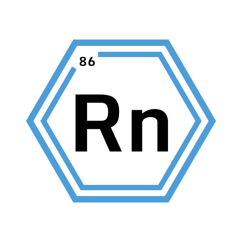

<div align="center" style="display:grid;place-items:center;">

<p>
  <a href="https://github.com/Radon-Language-Team" target="_blank">
    
  </a>
</p>

<h1>Radon Programming Language</h1>

<p><strong>A statically typed compiled language built from scratch — for learning, control, and creativity.</strong></p>

</div>

---

## 🧬 What is Radon?

**Radon** is a statically typed, compiled programming language developed from scratch as a personal project.

Unlike many modern languages that focus on developer ergonomics and flexibility, Radon is designed around **clarity, structure, and compiler-first design choices**.

Instead, Radon is inspired by:
- The **type safety and minimalism** of the V programming language
- The **rigor and performance orientation** of C
- A desire to **understand compilers deeply** — from tokenization to code generation

> ⚠️ Radon is in it's early development stage

---

## ✨ Features & Design Goals

Radon is built with the following principles in mind:

- **Statically typed**: types are known at compile time
- **Type inference**: no need to always specify types, but the compiler remains strict
- **Optional function parameters**: clean, flexible function declarations
- **Strict mutability rules**: variables are immutable by default
- **Low-level output**: generates readable and optimized C code, compiled using `tcc`, `gcc`, or `clang`
- **Readable syntax**: inspired by V, but customized for Radon’s own ecosystem

---

## 📦 Example (Compilable Radon Code Today)

Here’s what Radon looks like in its current state:

```
mixture 'core'

react testFunction(int Age, string Name) :void {
  println('Hello #(Name) with age #(Age)!')
}

react main() : int {
  elem greet = true
  iso name = ''

  if greet {
    elem request = read('What is your name?')
    name = request
  } else {
    name = 'Bob'
  }

  testFunction(21, name)
}

```
---

## 🛣 Roadmap

- [x] Basic syntax support
- [ ] Expression parser (WIP)
- [ ] Full type system
- [ ] Standard library
- [ ] Documentation site
- [ ] Debuggable REPL
- [ ] Compiler optimizations

Yes, it’s ambitious — and that’s exactly the point!  
Radon is a learning journey and a creative outlet.

---

## 🤝 Contributing

Radon is a solo-built language, but contributors are always welcome.  
If you're passionate about compilers, language design, or just curious, feel free to:

- Fork the repository
- Explore the compiler
- Fix a bug or improve something
- Submit a pull request

Even feedback, questions, or feature ideas help a lot!  
Join the [Radon Discord Server](https://discord.gg/UwKeDFssNH) and say hi — I’d love to hear your thoughts.

---

## 🧰 Building Radon

> ⚙️ Prerequisite: Install the [V Compiler](https://vlang.io)

### Steps

```bash
# Clone the repository
git clone https://github.com/Radon-Language-Team/radon
cd radon

# Build using the helper script
v run build.vsh

# Run the compiler (this starts the Radon REPL)
./radon/radon
```

---

## 🔗 Optional: Add Radon to PATH

To use Radon from anywhere on your system:

1. Run the `radon` binary as administrator.
2. In the REPL, type `symlink` and press Enter.
3. Restart your terminal.

---

## ⚙️ C Compiler Integration

Radon uses a C backend for now — compiling to C before handing off to a real-world C compiler.

Supported backends:
- ✅ [`tcc`](https://bellard.org/tcc/) (default)
- ✅ `gcc`
- ✅ `clang`

You can specify the compiler manually:

```bash
radon run file.rad -cc gcc
```

💙